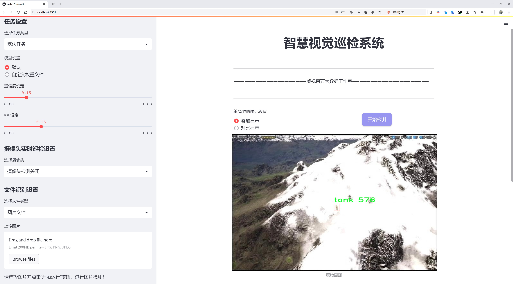
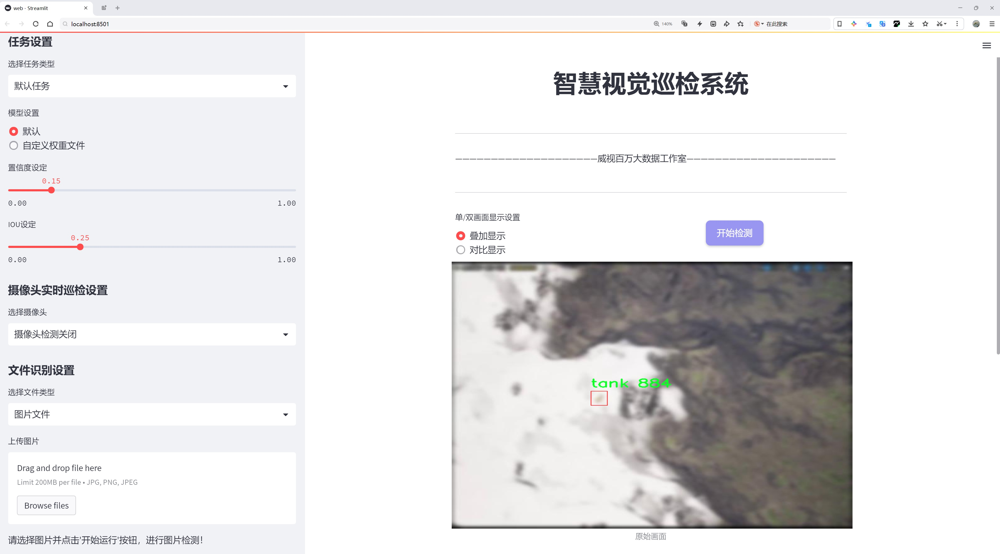
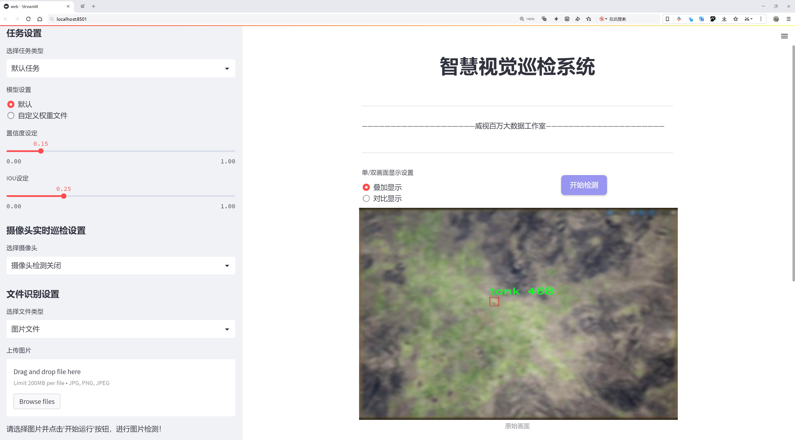
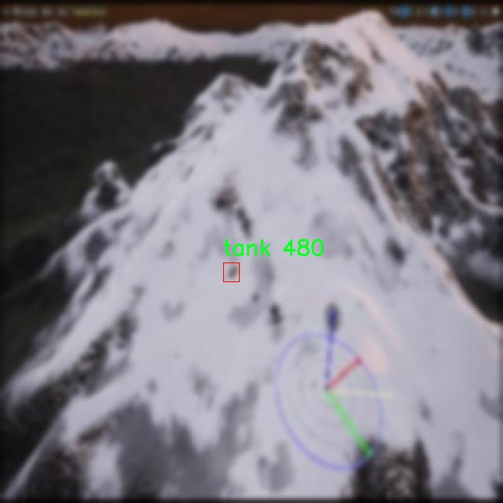
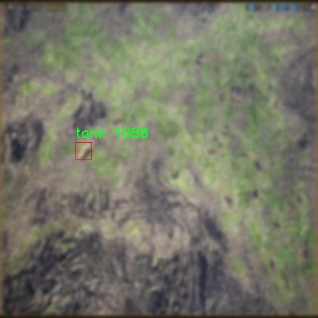
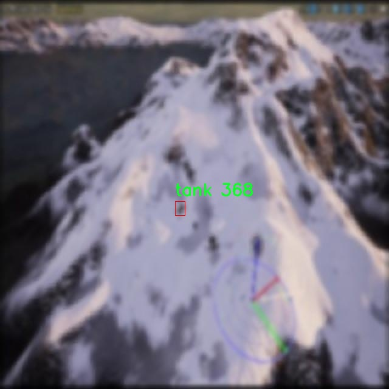
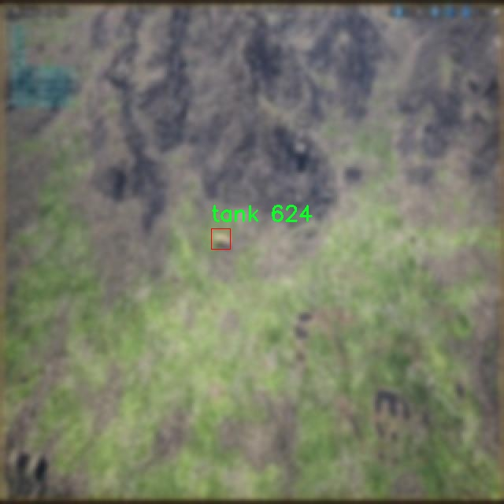
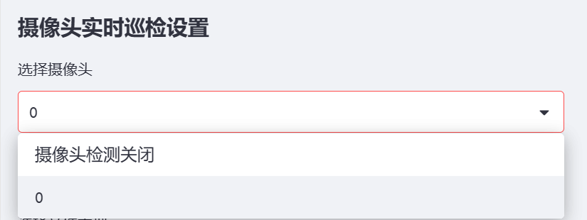

# 无人机画面坦克检测定位检测系统源码分享
 # [一条龙教学YOLOV8标注好的数据集一键训练_70+全套改进创新点发刊_Web前端展示]

### 1.研究背景与意义

项目参考[AAAI Association for the Advancement of Artificial Intelligence](https://gitee.com/qunshansj/projects)

项目来源[AACV Association for the Advancement of Computer Vision](https://gitee.com/qunmasj/projects)

研究背景与意义

随着科技的迅猛发展，无人机技术在军事、农业、环境监测等多个领域得到了广泛应用。尤其是在军事领域，无人机的使用为战场侦察、目标识别和打击提供了新的手段和思路。坦克作为现代战争中重要的地面作战装备，其快速、准确的检测与定位对于战术决策和作战效率至关重要。因此，基于无人机的坦克检测与定位系统的研究具有重要的理论意义和实际应用价值。

近年来，深度学习技术的快速发展为目标检测领域带来了革命性的变化。YOLO（You Only Look Once）系列模型以其高效的实时检测能力和较高的准确率，成为目标检测领域的研究热点。YOLOv8作为该系列的最新版本，结合了多种先进的技术，如改进的特征提取网络和更高效的训练策略，展现出了更强的检测性能。然而，针对特定场景下的目标检测，尤其是在复杂环境中，YOLOv8仍然面临着一定的挑战。因此，改进YOLOv8模型以提升其在无人机拍摄的坦克检测与定位任务中的表现，具有重要的研究意义。

本研究所使用的数据集包含3300张图像，专注于坦克这一单一类别的目标检测。这一数据集的构建不仅为模型的训练提供了丰富的样本，也为后续的模型评估和性能验证奠定了基础。通过对数据集的深入分析，我们可以更好地理解坦克在不同环境下的外观特征，从而为模型的改进提供数据支持。此外，数据集的多样性和复杂性将有助于提升模型的泛化能力，使其在实际应用中能够适应不同的场景和条件。

在无人机的应用场景中，环境因素如光照变化、天气条件、地形复杂性等都会对目标检测的准确性产生影响。因此，研究如何在这些变化中保持高效的检测性能，是本研究的重要目标之一。通过对YOLOv8模型的改进，我们将探索引入数据增强技术、特征融合策略以及模型集成方法等手段，以提升模型在复杂环境下的鲁棒性和准确性。

综上所述，基于改进YOLOv8的无人机画面坦克检测定位系统的研究，不仅能够推动目标检测技术的发展，还能为无人机在军事领域的应用提供技术支持。通过本研究，我们期望能够实现高效、准确的坦克检测与定位，为未来的战场智能化提供重要的技术保障。这一研究的成功实施，将为无人机技术的进一步发展开辟新的方向，同时也为相关领域的研究提供新的思路和方法。

### 2.图片演示







##### 注意：由于此博客编辑较早，上面“2.图片演示”和“3.视频演示”展示的系统图片或者视频可能为老版本，新版本在老版本的基础上升级如下：（实际效果以升级的新版本为准）

  （1）适配了YOLOV8的“目标检测”模型和“实例分割”模型，通过加载相应的权重（.pt）文件即可自适应加载模型。

  （2）支持“图片识别”、“视频识别”、“摄像头实时识别”三种识别模式。

  （3）支持“图片识别”、“视频识别”、“摄像头实时识别”三种识别结果保存导出，解决手动导出（容易卡顿出现爆内存）存在的问题，识别完自动保存结果并导出到tempDir中。

  （4）支持Web前端系统中的标题、背景图等自定义修改，后面提供修改教程。

  另外本项目提供训练的数据集和训练教程,暂不提供权重文件（best.pt）,需要您按照教程进行训练后实现图片演示和Web前端界面演示的效果。

### 3.视频演示

[3.1 视频演示](https://www.bilibili.com/video/BV1Qq4He3EUY/)

### 4.数据集信息展示

##### 4.1 本项目数据集详细数据（类别数＆类别名）

nc: 1
names: ['tank']


##### 4.2 本项目数据集信息介绍

数据集信息展示

在本研究中，我们使用了名为“car_augm”的数据集，以改进YOLOv8的无人机画面坦克检测定位系统。该数据集专注于单一类别的目标检测，具体为“坦克”。通过这一数据集的构建与应用，我们旨在提升无人机在复杂环境中对坦克目标的识别与定位能力。

“car_augm”数据集的设计理念是为了解决传统目标检测模型在特定环境下的局限性，尤其是在军事侦察和战场监控等应用场景中。无人机在执行任务时，往往需要在高空中快速、准确地识别地面目标，而坦克作为一种重要的军事装备，其检测与定位的准确性直接影响到战术决策的有效性。因此，构建一个高质量的坦克检测数据集显得尤为重要。

该数据集的类别数量为1，具体类别为“tank”。这一单一类别的选择使得数据集在训练过程中能够集中于坦克目标的特征提取与学习，避免了多类别数据集在目标识别时可能出现的混淆和干扰。通过聚焦于坦克这一特定目标，我们能够更深入地分析其在不同环境下的外观特征、形态变化以及在各种背景下的可见性。这种专注不仅提高了模型的学习效率，也增强了其在实际应用中的可靠性。

“car_augm”数据集的构建过程包括了多种数据增强技术，以确保模型在训练过程中能够接触到丰富多样的坦克图像。这些数据增强方法可能包括图像旋转、缩放、裁剪、亮度调整等，旨在模拟不同的环境条件和视角变化。这种多样性不仅提高了模型的泛化能力，还使得其在面对复杂场景时能够保持较高的检测精度。

此外，数据集中的图像来源广泛，涵盖了不同类型的坦克及其在多种地形和环境中的表现。这种多样化的图像数据能够帮助模型学习到坦克在不同背景下的特征，从而提高其在实际应用中的适应性。例如，坦克在沙漠、森林、城市等不同环境中的外观可能存在显著差异，模型需要能够识别这些差异并做出准确判断。

在数据集的标注过程中，我们采用了精确的标注策略，确保每一张图像中的坦克目标都被准确标记。这一过程不仅提高了数据集的质量，也为后续的模型训练提供了坚实的基础。通过精确的标注，模型能够更好地学习到坦克的边界框信息，从而在实际应用中实现高效的目标定位。

综上所述，“car_augm”数据集为改进YOLOv8的无人机画面坦克检测定位系统提供了重要的支持。通过专注于单一类别的坦克目标，结合丰富的图像数据和多样化的增强技术，我们期待能够显著提升模型在复杂环境中的检测能力，为未来的军事应用提供更为精准的技术保障。










### 5.全套项目环境部署视频教程（零基础手把手教学）

[5.1 环境部署教程链接（零基础手把手教学）](https://www.ixigua.com/7404473917358506534?logTag=c807d0cbc21c0ef59de5)


[5.2 安装Python虚拟环境创建和依赖库安装视频教程链接（零基础手把手教学）](https://www.ixigua.com/7404474678003106304?logTag=1f1041108cd1f708b01a)

### 6.手把手YOLOV8训练视频教程（零基础小白有手就能学会）

[6.1 手把手YOLOV8训练视频教程（零基础小白有手就能学会）](https://www.ixigua.com/7404477157818401292?logTag=d31a2dfd1983c9668658)

### 7.70+种全套YOLOV8创新点代码加载调参视频教程（一键加载写好的改进模型的配置文件）

[7.1 70+种全套YOLOV8创新点代码加载调参视频教程（一键加载写好的改进模型的配置文件）](https://www.ixigua.com/7404478314661806627?logTag=29066f8288e3f4eea3a4)

### 8.70+种全套YOLOV8创新点原理讲解（非科班也可以轻松写刊发刊，V10版本正在科研待更新）

由于篇幅限制，每个创新点的具体原理讲解就不一一展开，具体见下列网址中的创新点对应子项目的技术原理博客网址【Blog】：


[8.1 70+种全套YOLOV8创新点原理讲解链接](https://gitee.com/qunmasj/good)

### 9.系统功能展示（检测对象为举例，实际内容以本项目数据集为准）

图9.1.系统支持检测结果表格显示

  图9.2.系统支持置信度和IOU阈值手动调节

  图9.3.系统支持自定义加载权重文件best.pt(需要你通过步骤5中训练获得)

  图9.4.系统支持摄像头实时识别

  图9.5.系统支持图片识别

  图9.6.系统支持视频识别

  图9.7.系统支持识别结果文件自动保存

  图9.8.系统支持Excel导出检测结果数据





### 10.原始YOLOV8算法原理

原始YOLOv8算法原理

YOLOv8作为YOLO系列目标检测模型的最新版本，展现了其在目标检测领域的卓越性能和灵活性。其设计理念基于深度学习的先进技术，尤其是在特征提取和目标检测的效率与准确性方面进行了多项创新。YOLOv8s模型的架构主要由三部分组成：Backbone、Neck和Head，这三部分协同工作，确保了模型在处理输入图像时能够高效地提取特征并进行准确的目标检测。

在Backbone部分，YOLOv8s采用了CSPDarknet（Cross Stage Partial Darknet）结构，这一结构的设计目的是通过分段处理来提高特征提取的效率。CSPDarknet将网络分为两个主要部分，每个部分都包含多个残差块，这种设计不仅保留了深度学习模型的深度，还有效地增强了梯度流动，避免了梯度消失的问题。相较于前代模型YOLOv5，YOLOv8s引入了C2f模块替代了C3模块。C2f模块的创新在于将输入特征图分为两个分支，分别经过卷积层进行降维处理。每个分支的输出再被整合，形成更高维度的特征图，这种分支结构的设计极大地丰富了模型所能学习到的特征信息。

YOLOv8s在特征提取方面还引入了快速空间金字塔池化（SPPF）结构，旨在提取不同尺度的特征。这一结构的优势在于能够有效减少模型的参数量和计算量，同时提高特征提取的效率，使得模型在面对多样化的目标时，依然能够保持高效的处理能力。通过这些改进，YOLOv8s能够在不同场景下灵活应对，尤其是在复杂背景下的目标检测任务中，表现出色。

在Neck部分，YOLOv8s采用了特征金字塔网络（FPN）与路径聚合网络（PAN）的结合，这一结构通过多层卷积和池化操作对特征图进行处理和压缩。Neck的设计不仅保证了特征信息的充分利用，还通过上下采样的方式有效融合了不同尺度的特征图，确保了模型在检测过程中能够兼顾小目标和大目标的识别能力。

YOLOv8s的Head部分则采用了无锚框（Anchor-Free）检测方式，直接预测目标的中心点及其宽高比例。这一创新的检测方式显著减少了Anchor框的数量，从而提高了检测速度和准确度。通过这种方式，YOLOv8s能够在实时性要求较高的应用场景中表现出色。此外，YOLOv8s还引入了任务对齐学习（Task Alignment Learning, TAL），这一方法通过引入分类分数和IOU的高次幂乘积作为衡量任务对齐程度的指标，进一步提升了模型在分类和定位任务中的表现。

在训练过程中，YOLOv8s采用了一系列数据增强技术来提升模型的鲁棒性和泛化能力。其中，Mosaic数据增强被广泛应用于训练阶段，尽管它在一定程度上可能会破坏数据的真实分布，但在训练的最后10个epoch中，YOLOv8s会停止使用这种增强方式，以确保模型学习到的特征更贴近真实场景。

YOLOv8s的整体设计充分考虑了目标检测任务的实时性和准确性需求。通过引入更高效的特征提取模块、优化的网络结构以及无锚框的检测方式，YOLOv8s在保证模型轻量化的同时，极大地提升了检测的精度和速度。这使得YOLOv8s在实际应用中，尤其是在移动平台和资源受限的环境中，展现出良好的适应性和性能。

在评估模型性能时，YOLOv8s在COCO数据集上的表现尤为突出。通过对比不同尺寸模型的mAP（mean Average Precision）指标，YOLOv8s在同等参数量的前提下，取得了更高的检测精度。此外，在推理速度方面，YOLOv8s同样表现优异，证明了其在目标检测领域的竞争力。

总的来说，YOLOv8作为YOLO系列的最新进展，凭借其创新的网络结构和高效的特征提取能力，成为了目标检测领域的重要工具。它不仅在学术研究中具有广泛的应用潜力，也为实际应用提供了强有力的支持，尤其是在需要实时处理和高准确度的场景中，YOLOv8展现了其独特的价值。随着对YOLOv8的深入研究和不断改进，未来有望在更多复杂环境中实现更为出色的目标检测性能。


### 11.项目核心源码讲解（再也不用担心看不懂代码逻辑）

#### 11.1 code\ultralytics\trackers\byte_tracker.py

以下是经过简化和注释的核心代码部分，主要包括 `STrack` 和 `BYTETracker` 类的核心功能。

```python
import numpy as np
from .basetrack import BaseTrack, TrackState
from .utils import matching
from .utils.kalman_filter import KalmanFilterXYAH

class STrack(BaseTrack):
    """
    单个对象跟踪表示，使用卡尔曼滤波进行状态估计。
    """

    shared_kalman = KalmanFilterXYAH()  # 共享的卡尔曼滤波器实例

    def __init__(self, tlwh, score, cls):
        """初始化新的 STrack 实例。"""
        super().__init__()
        self._tlwh = np.asarray(self.tlbr_to_tlwh(tlwh[:-1]), dtype=np.float32)  # 存储边界框信息
        self.kalman_filter = None  # 特定对象跟踪的卡尔曼滤波器
        self.mean, self.covariance = None, None  # 状态均值和协方差
        self.is_activated = False  # 跟踪是否被激活的标志

        self.score = score  # 跟踪的置信度分数
        self.tracklet_len = 0  # 跟踪片段长度
        self.cls = cls  # 对象类别
        self.idx = tlwh[-1]  # 对象索引

    def predict(self):
        """使用卡尔曼滤波器预测对象的下一个状态。"""
        mean_state = self.mean.copy()  # 复制当前均值状态
        if self.state != TrackState.Tracked:
            mean_state[7] = 0  # 如果状态不是跟踪状态，设置速度为0
        self.mean, self.covariance = self.kalman_filter.predict(mean_state, self.covariance)  # 预测下一个状态

    def activate(self, kalman_filter, frame_id):
        """激活新的跟踪片段。"""
        self.kalman_filter = kalman_filter  # 设置卡尔曼滤波器
        self.track_id = self.next_id()  # 获取新的跟踪ID
        self.mean, self.covariance = self.kalman_filter.initiate(self.convert_coords(self._tlwh))  # 初始化状态

        self.tracklet_len = 0  # 重置跟踪片段长度
        self.state = TrackState.Tracked  # 设置状态为跟踪
        if frame_id == 1:
            self.is_activated = True  # 第一个帧激活
        self.frame_id = frame_id  # 设置当前帧ID
        self.start_frame = frame_id  # 设置开始帧ID

    def update(self, new_track, frame_id):
        """更新匹配跟踪的状态。"""
        self.frame_id = frame_id  # 更新当前帧ID
        self.tracklet_len += 1  # 增加跟踪片段长度

        new_tlwh = new_track.tlwh  # 获取新的边界框
        self.mean, self.covariance = self.kalman_filter.update(
            self.mean, self.covariance, self.convert_coords(new_tlwh)
        )  # 更新状态
        self.state = TrackState.Tracked  # 设置状态为跟踪
        self.is_activated = True  # 设置为已激活

        self.score = new_track.score  # 更新置信度分数
        self.cls = new_track.cls  # 更新类别
        self.idx = new_track.idx  # 更新索引

class BYTETracker:
    """
    BYTETracker: 基于 YOLOv8 的对象检测和跟踪算法。
    """

    def __init__(self, args, frame_rate=30):
        """初始化 YOLOv8 对象以跟踪对象。"""
        self.tracked_stracks = []  # 成功激活的跟踪列表
        self.lost_stracks = []  # 丢失的跟踪列表
        self.removed_stracks = []  # 移除的跟踪列表

        self.frame_id = 0  # 当前帧ID
        self.args = args  # 命令行参数
        self.max_time_lost = int(frame_rate / 30.0 * args.track_buffer)  # 最大丢失时间
        self.kalman_filter = self.get_kalmanfilter()  # 获取卡尔曼滤波器
        self.reset_id()  # 重置ID

    def update(self, results, img=None):
        """使用新检测更新对象跟踪器。"""
        self.frame_id += 1  # 增加帧ID
        activated_stracks = []  # 激活的跟踪列表
        refind_stracks = []  # 重新找到的跟踪列表
        lost_stracks = []  # 丢失的跟踪列表
        removed_stracks = []  # 移除的跟踪列表

        scores = results.conf  # 检测的置信度分数
        bboxes = results.xyxy  # 检测的边界框
        bboxes = np.concatenate([bboxes, np.arange(len(bboxes)).reshape(-1, 1)], axis=-1)  # 添加索引
        cls = results.cls  # 检测的类别

        # 过滤检测结果
        remain_inds = scores > self.args.track_high_thresh
        dets = bboxes[remain_inds]  # 高置信度检测
        scores_keep = scores[remain_inds]  # 高置信度分数
        cls_keep = cls[remain_inds]  # 高置信度类别

        # 初始化跟踪
        detections = self.init_track(dets, scores_keep, cls_keep, img)
        # 将新检测的跟踪片段添加到 tracked_stracks
        unconfirmed = [track for track in self.tracked_stracks if not track.is_activated]
        tracked_stracks = [track for track in self.tracked_stracks if track.is_activated]

        # 进行跟踪状态的预测和更新
        strack_pool = self.joint_stracks(tracked_stracks, self.lost_stracks)  # 合并跟踪列表
        self.multi_predict(strack_pool)  # 多目标预测

        # 计算距离并进行匹配
        dists = self.get_dists(strack_pool, detections)  # 计算距离
        matches, u_track, u_detection = matching.linear_assignment(dists, thresh=self.args.match_thresh)  # 匹配

        # 更新匹配的跟踪
        for itracked, idet in matches:
            track = strack_pool[itracked]
            det = detections[idet]
            track.update(det, self.frame_id)  # 更新跟踪状态
            activated_stracks.append(track)  # 添加到激活列表

        # 初始化新的跟踪片段
        for inew in u_detection:
            track = detections[inew]
            if track.score < self.args.new_track_thresh:
                continue
            track.activate(self.kalman_filter, self.frame_id)  # 激活新的跟踪
            activated_stracks.append(track)

        # 更新状态
        self.tracked_stracks = [t for t in self.tracked_stracks if t.state == TrackState.Tracked]  # 过滤有效跟踪
        self.tracked_stracks = self.joint_stracks(self.tracked_stracks, activated_stracks)  # 合并激活的跟踪
        self.lost_stracks = self.sub_stracks(self.lost_stracks, self.tracked_stracks)  # 更新丢失的跟踪

        return np.asarray(
            [x.tlbr.tolist() + [x.track_id, x.score, x.cls, x.idx] for x in self.tracked_stracks if x.is_activated],
            dtype=np.float32,
        )  # 返回激活的跟踪结果

    def get_kalmanfilter(self):
        """返回用于跟踪边界框的卡尔曼滤波器对象。"""
        return KalmanFilterXYAH()

    def init_track(self, dets, scores, cls, img=None):
        """使用检测初始化对象跟踪。"""
        return [STrack(xyxy, s, c) for (xyxy, s, c) in zip(dets, scores, cls)] if len(dets) else []  # 初始化跟踪

    def get_dists(self, tracks, detections):
        """计算跟踪和检测之间的距离。"""
        dists = matching.iou_distance(tracks, detections)  # 计算IOU距离
        dists = matching.fuse_score(dists, detections)  # 融合分数
        return dists

    def multi_predict(self, tracks):
        """返回预测的跟踪。"""
        STrack.multi_predict(tracks)

    @staticmethod
    def joint_stracks(tlista, tlistb):
        """合并两个跟踪列表。"""
        exists = {}
        res = []
        for t in tlista:
            exists[t.track_id] = 1
            res.append(t)
        for t in tlistb:
            tid = t.track_id
            if not exists.get(tid, 0):
                exists[tid] = 1
                res.append(t)
        return res
```

### 代码核心部分说明：
1. **STrack 类**：负责单个对象的跟踪，使用卡尔曼滤波器进行状态预测和更新。包含初始化、预测、激活、更新等方法。
2. **BYTETracker 类**：负责管理多个对象的跟踪，处理检测结果，更新跟踪状态，计算距离并进行匹配。通过 `update` 方法整合所有功能，更新跟踪状态并返回当前跟踪的边界框信息。

通过这些核心部分和注释，可以更好地理解该代码的功能和结构。

该文件实现了一个基于YOLOv8的对象跟踪算法，主要包含两个类：`STrack`和`BYTETracker`。`STrack`类用于表示单个对象的跟踪信息，使用卡尔曼滤波器进行状态估计。它包含多个属性和方法，用于初始化跟踪、预测状态、更新状态等。`BYTETracker`类则负责管理多个对象的跟踪，处理新检测到的对象、更新现有跟踪、处理丢失和移除的跟踪等。

在`STrack`类中，主要属性包括共享的卡尔曼滤波器、边界框的坐标和尺寸、卡尔曼滤波器实例、状态均值和协方差、激活状态、置信度分数、跟踪长度、类别标签、索引和帧ID等。类的方法包括状态预测、激活新跟踪、重新激活丢失的跟踪、更新状态、坐标转换等。

`BYTETracker`类则包含跟踪的核心逻辑，初始化时设置跟踪的状态、最大丢失时间和卡尔曼滤波器。其`update`方法负责处理新检测结果，进行跟踪的激活、更新和丢失处理。该方法首先对新检测结果进行处理，然后与当前跟踪的对象进行匹配，更新状态并处理未确认的跟踪。它还实现了多种辅助方法，如计算距离、初始化跟踪、合并和过滤跟踪列表等。

整体来看，该文件实现了一个完整的对象跟踪系统，利用卡尔曼滤波器进行状态预测和更新，结合YOLOv8进行对象检测，能够有效地管理和维护多个对象的跟踪状态。

#### 11.2 ui.py

```python
import sys
import subprocess

def run_script(script_path):
    """
    使用当前 Python 环境运行指定的脚本。

    Args:
        script_path (str): 要运行的脚本路径

    Returns:
        None
    """
    # 获取当前 Python 解释器的路径
    python_path = sys.executable

    # 构建运行命令
    command = f'"{python_path}" -m streamlit run "{script_path}"'

    # 执行命令
    result = subprocess.run(command, shell=True)
    if result.returncode != 0:
        print("脚本运行出错。")


# 实例化并运行应用
if __name__ == "__main__":
    # 指定您的脚本路径
    script_path = "web.py"  # 这里可以直接指定脚本路径

    # 运行脚本
    run_script(script_path)
```

### 代码注释说明：

1. **导入模块**：
   - `import sys`：导入系统相关的模块，用于获取当前 Python 解释器的路径。
   - `import subprocess`：导入子进程模块，用于在 Python 中执行外部命令。

2. **定义 `run_script` 函数**：
   - 该函数接收一个参数 `script_path`，表示要运行的 Python 脚本的路径。
   - 函数内部首先获取当前 Python 解释器的路径，以便在后续的命令中使用。

3. **构建运行命令**：
   - 使用 f-string 格式化字符串，构建运行命令。命令格式为：`python -m streamlit run <script_path>`，其中 `<script_path>` 是传入的脚本路径。

4. **执行命令**：
   - 使用 `subprocess.run` 方法执行构建好的命令，`shell=True` 允许在 shell 中执行命令。
   - 检查命令执行的返回码，如果返回码不为 0，表示脚本运行出错，打印错误信息。

5. **主程序入口**：
   - `if __name__ == "__main__":` 确保该代码块仅在直接运行该脚本时执行。
   - 指定要运行的脚本路径 `script_path`，这里直接指定为 `"web.py"`。
   - 调用 `run_script` 函数来运行指定的脚本。

这个程序文件名为 `ui.py`，其主要功能是使用当前的 Python 环境来运行一个指定的脚本，具体是通过 Streamlit 来启动一个 Web 应用。

首先，程序导入了必要的模块，包括 `sys`、`os` 和 `subprocess`。`sys` 模块用于访问与 Python 解释器相关的变量和函数，`os` 模块提供了与操作系统交互的功能，而 `subprocess` 模块则用于执行外部命令。

接下来，程序从 `QtFusion.path` 模块中导入了 `abs_path` 函数，这个函数的作用是获取文件的绝对路径。

在 `run_script` 函数中，程序接受一个参数 `script_path`，这个参数是要运行的脚本的路径。函数首先获取当前 Python 解释器的路径，接着构建一个命令字符串，该命令用于运行 Streamlit，并指定要执行的脚本。命令的格式是 `"{python_path}" -m streamlit run "{script_path}"`，其中 `python_path` 是当前 Python 解释器的路径，`script_path` 是要运行的脚本路径。

然后，程序使用 `subprocess.run` 方法来执行构建好的命令。这个方法会在 shell 中运行命令，并返回一个结果对象。通过检查 `result.returncode`，程序可以判断脚本是否成功运行。如果返回码不为 0，表示脚本运行出错，程序会打印出相应的错误信息。

在文件的最后部分，程序通过 `if __name__ == "__main__":` 语句来判断当前模块是否是主程序。如果是，程序会指定要运行的脚本路径，这里是通过 `abs_path("web.py")` 获取 `web.py` 的绝对路径。最后，调用 `run_script` 函数来执行这个脚本。

总体来说，这个程序的核心功能是提供一个简单的接口来运行一个 Streamlit 应用，方便用户在当前 Python 环境中启动 Web 应用。

#### 11.3 70+种YOLOv8算法改进源码大全和调试加载训练教程（非必要）\ultralytics\models\fastsam\utils.py

以下是代码中最核心的部分，并附上详细的中文注释：

```python
import torch

def adjust_bboxes_to_image_border(boxes, image_shape, threshold=20):
    """
    调整边界框，使其在距离图像边界一定阈值内时贴近边界。

    参数:
        boxes (torch.Tensor): 边界框的坐标，形状为 (n, 4)
        image_shape (tuple): 图像的高度和宽度，形状为 (height, width)
        threshold (int): 像素阈值，默认为20

    返回:
        adjusted_boxes (torch.Tensor): 调整后的边界框
    """

    # 获取图像的高度和宽度
    h, w = image_shape

    # 调整边界框的位置
    boxes[boxes[:, 0] < threshold, 0] = 0  # 如果左上角x坐标小于阈值，则设置为0
    boxes[boxes[:, 1] < threshold, 1] = 0  # 如果左上角y坐标小于阈值，则设置为0
    boxes[boxes[:, 2] > w - threshold, 2] = w  # 如果右下角x坐标大于图像宽度减去阈值，则设置为图像宽度
    boxes[boxes[:, 3] > h - threshold, 3] = h  # 如果右下角y坐标大于图像高度减去阈值，则设置为图像高度
    return boxes


def bbox_iou(box1, boxes, iou_thres=0.9, image_shape=(640, 640), raw_output=False):
    """
    计算一个边界框与其他边界框的交并比（IoU）。

    参数:
        box1 (torch.Tensor): 单个边界框的坐标，形状为 (4, )
        boxes (torch.Tensor): 其他边界框的坐标，形状为 (n, 4)
        iou_thres (float): IoU阈值，默认为0.9
        image_shape (tuple): 图像的高度和宽度，形状为 (height, width)
        raw_output (bool): 如果为True，则返回原始IoU值而不是索引

    返回:
        high_iou_indices (torch.Tensor): IoU大于阈值的边界框索引
    """
    # 调整边界框以确保其在图像边界内
    boxes = adjust_bboxes_to_image_border(boxes, image_shape)

    # 计算交集的坐标
    x1 = torch.max(box1[0], boxes[:, 0])  # 交集左上角x坐标
    y1 = torch.max(box1[1], boxes[:, 1])  # 交集左上角y坐标
    x2 = torch.min(box1[2], boxes[:, 2])  # 交集右下角x坐标
    y2 = torch.min(box1[3], boxes[:, 3])  # 交集右下角y坐标

    # 计算交集的面积
    intersection = (x2 - x1).clamp(0) * (y2 - y1).clamp(0)

    # 计算两个边界框的面积
    box1_area = (box1[2] - box1[0]) * (box1[3] - box1[1])  # box1的面积
    box2_area = (boxes[:, 2] - boxes[:, 0]) * (boxes[:, 3] - boxes[:, 1])  # boxes的面积

    # 计算并集的面积
    union = box1_area + box2_area - intersection

    # 计算IoU
    iou = intersection / union  # IoU值，形状为 (n, )
    
    if raw_output:
        return 0 if iou.numel() == 0 else iou  # 如果需要原始IoU值，直接返回

    # 返回IoU大于阈值的边界框索引
    return torch.nonzero(iou > iou_thres).flatten()
```

### 代码核心部分说明：
1. **`adjust_bboxes_to_image_border` 函数**：用于调整边界框的位置，使其在接近图像边界时贴近边界，避免边界框超出图像范围。
2. **`bbox_iou` 函数**：计算一个边界框与其他边界框的交并比（IoU），并返回IoU大于设定阈值的边界框索引。此函数首先调用 `adjust_bboxes_to_image_border` 来确保所有边界框都在图像范围内，然后计算交集和并集，最后返回满足条件的索引。

这个程序文件是用于YOLO（You Only Look Once）目标检测算法的一部分，主要包含两个函数，分别用于调整边界框和计算交并比（IoU）。

首先，`adjust_bboxes_to_image_border`函数的作用是调整给定的边界框，使其在图像边界内。如果边界框的某个边距离图像边界小于指定的阈值（默认为20像素），则将该边界框的坐标调整到图像边界上。函数接受三个参数：`boxes`是一个包含多个边界框的张量，每个边界框由四个坐标（x1, y1, x2, y2）表示；`image_shape`是图像的高度和宽度；`threshold`是允许的像素阈值。函数返回调整后的边界框。

接下来的`bbox_iou`函数用于计算一个边界框与一组其他边界框之间的交并比。它接受多个参数，包括待计算的边界框`box1`、其他边界框`boxes`、IoU阈值`iou_thres`、图像的形状`image_shape`以及一个布尔值`raw_output`，用于指示是否返回原始的IoU值。函数首先调用`adjust_bboxes_to_image_border`来确保所有边界框都在图像边界内。然后，它计算`box1`与每个`boxes`中的边界框的交集坐标，并根据这些坐标计算交集面积。接着，计算两个边界框的面积以及它们的并集面积，最后通过交集面积除以并集面积来得到IoU值。如果`raw_output`为真，函数将返回IoU值；否则，返回与IoU大于阈值的边界框的索引。

总体而言，这段代码的主要功能是确保边界框在图像内，并计算它们之间的重叠程度，这对于目标检测任务中的边界框过滤和评估非常重要。

#### 11.4 70+种YOLOv8算法改进源码大全和调试加载训练教程（非必要）\ultralytics\trackers\basetrack.py

以下是代码中最核心的部分，并附上详细的中文注释：

```python
from collections import OrderedDict
import numpy as np

class TrackState:
    """跟踪状态的枚举类，表示可能的对象跟踪状态。"""
    New = 0      # 新建状态
    Tracked = 1  # 被跟踪状态
    Lost = 2     # 丢失状态
    Removed = 3  # 被移除状态

class BaseTrack:
    """对象跟踪的基类，处理基本的跟踪属性和操作。"""

    _count = 0  # 全局跟踪ID计数器

    track_id = 0  # 当前跟踪的ID
    is_activated = False  # 跟踪是否被激活
    state = TrackState.New  # 当前跟踪状态，初始为新建状态

    history = OrderedDict()  # 存储跟踪历史的有序字典
    features = []  # 存储特征的列表
    curr_feature = None  # 当前特征
    score = 0  # 跟踪得分
    start_frame = 0  # 跟踪开始的帧数
    frame_id = 0  # 当前帧数
    time_since_update = 0  # 自上次更新以来的时间

    # 多摄像头支持
    location = (np.inf, np.inf)  # 跟踪对象的位置，初始为无穷大

    @property
    def end_frame(self):
        """返回跟踪的最后一帧ID。"""
        return self.frame_id

    @staticmethod
    def next_id():
        """递增并返回全局跟踪ID计数器。"""
        BaseTrack._count += 1
        return BaseTrack._count

    def activate(self, *args):
        """激活跟踪，使用提供的参数。"""
        raise NotImplementedError  # 该方法需要在子类中实现

    def predict(self):
        """预测跟踪的下一个状态。"""
        raise NotImplementedError  # 该方法需要在子类中实现

    def update(self, *args, **kwargs):
        """使用新的观测值更新跟踪。"""
        raise NotImplementedError  # 该方法需要在子类中实现

    def mark_lost(self):
        """将跟踪标记为丢失状态。"""
        self.state = TrackState.Lost

    def mark_removed(self):
        """将跟踪标记为移除状态。"""
        self.state = TrackState.Removed

    @staticmethod
    def reset_id():
        """重置全局跟踪ID计数器。"""
        BaseTrack._count = 0
```

### 代码说明：
1. **TrackState 类**：定义了跟踪对象的状态，包括新建、被跟踪、丢失和被移除。
2. **BaseTrack 类**：是一个对象跟踪的基类，包含了跟踪的基本属性和方法。
   - `track_id`：当前跟踪对象的唯一标识符。
   - `is_activated`：标识跟踪对象是否已激活。
   - `state`：当前跟踪状态，初始为新建状态。
   - `history`：记录跟踪历史的有序字典。
   - `features` 和 `curr_feature`：用于存储跟踪对象的特征。
   - `score`：跟踪的得分。
   - `start_frame` 和 `frame_id`：用于记录跟踪的帧数。
   - `time_since_update`：记录自上次更新以来的时间。
   - `location`：支持多摄像头跟踪，记录对象的位置。

3. **方法**：
   - `next_id()`：生成新的跟踪ID。
   - `activate()`、`predict()`、`update()`：这些方法需要在子类中实现，用于激活跟踪、预测下一个状态和更新跟踪。
   - `mark_lost()` 和 `mark_removed()`：用于更新跟踪状态为丢失或移除。
   - `reset_id()`：重置跟踪ID计数器。

这个程序文件是一个用于对象跟踪的基础类的实现，属于YOLO（You Only Look Once）系列算法的一部分，主要用于处理视频中的物体追踪。文件中定义了两个主要的类：`TrackState`和`BaseTrack`。

`TrackState`类是一个枚举类型，用于表示物体跟踪的不同状态，包括新跟踪（New）、已跟踪（Tracked）、丢失（Lost）和已移除（Removed）。这些状态帮助跟踪系统管理物体在视频中的生命周期。

`BaseTrack`类是一个基类，提供了物体跟踪的基本属性和操作。它包含了一个全局的跟踪ID计数器，能够为每个跟踪实例分配唯一的ID。类中定义了一些属性，如`track_id`（跟踪ID）、`is_activated`（是否激活）、`state`（当前状态）、`history`（跟踪历史）、`features`（特征）、`score`（评分）、`start_frame`（起始帧）、`frame_id`（当前帧ID）、`time_since_update`（自上次更新以来的时间）以及`location`（位置，支持多摄像头）。

`BaseTrack`类还定义了一些方法，包括获取跟踪的结束帧ID的属性`end_frame`，静态方法`next_id()`用于递增并返回全局跟踪ID，`activate()`方法用于激活跟踪（需要具体实现），`predict()`方法用于预测跟踪的下一个状态（同样需要具体实现），`update()`方法用于更新跟踪信息（需要具体实现），`mark_lost()`和`mark_removed()`方法用于将跟踪状态标记为丢失或已移除。

最后，`reset_id()`静态方法用于重置全局跟踪ID计数器，确保在某些情况下可以重新开始跟踪。

总体来说，这个文件为YOLOv8的对象跟踪提供了一个基础框架，允许开发者在此基础上实现更复杂的跟踪逻辑和功能。

#### 11.5 train.py

以下是代码中最核心的部分，并附上详细的中文注释：

```python
class DetectionTrainer(BaseTrainer):
    """
    DetectionTrainer类用于基于检测模型进行训练，继承自BaseTrainer类。
    """

    def build_dataset(self, img_path, mode="train", batch=None):
        """
        构建YOLO数据集。

        参数:
            img_path (str): 包含图像的文件夹路径。
            mode (str): 模式，`train`表示训练模式，`val`表示验证模式，用户可以为每种模式自定义不同的增强。
            batch (int, optional): 批次大小，仅用于`rect`模式。默认为None。
        """
        gs = max(int(de_parallel(self.model).stride.max() if self.model else 0), 32)  # 获取模型的最大步幅
        return build_yolo_dataset(self.args, img_path, batch, self.data, mode=mode, rect=mode == "val", stride=gs)

    def get_dataloader(self, dataset_path, batch_size=16, rank=0, mode="train"):
        """构建并返回数据加载器。"""
        assert mode in ["train", "val"]  # 确保模式为训练或验证
        with torch_distributed_zero_first(rank):  # 在分布式环境中仅初始化一次数据集
            dataset = self.build_dataset(dataset_path, mode, batch_size)  # 构建数据集
        shuffle = mode == "train"  # 训练模式下打乱数据
        if getattr(dataset, "rect", False) and shuffle:
            LOGGER.warning("WARNING ⚠️ 'rect=True' is incompatible with DataLoader shuffle, setting shuffle=False")
            shuffle = False  # 如果是rect模式且需要打乱，则禁用打乱
        workers = self.args.workers if mode == "train" else self.args.workers * 2  # 设置工作线程数
        return build_dataloader(dataset, batch_size, workers, shuffle, rank)  # 返回数据加载器

    def preprocess_batch(self, batch):
        """对一批图像进行预处理，包括缩放和转换为浮点数。"""
        batch["img"] = batch["img"].to(self.device, non_blocking=True).float() / 255  # 将图像转换为浮点数并归一化
        if self.args.multi_scale:  # 如果启用多尺度训练
            imgs = batch["img"]
            sz = (
                random.randrange(self.args.imgsz * 0.5, self.args.imgsz * 1.5 + self.stride)
                // self.stride
                * self.stride
            )  # 随机选择一个新的尺寸
            sf = sz / max(imgs.shape[2:])  # 计算缩放因子
            if sf != 1:
                ns = [
                    math.ceil(x * sf / self.stride) * self.stride for x in imgs.shape[2:]
                ]  # 计算新的形状
                imgs = nn.functional.interpolate(imgs, size=ns, mode="bilinear", align_corners=False)  # 进行插值缩放
            batch["img"] = imgs  # 更新批次中的图像
        return batch

    def set_model_attributes(self):
        """设置模型的属性，包括类别数量和名称。"""
        self.model.nc = self.data["nc"]  # 将类别数量附加到模型
        self.model.names = self.data["names"]  # 将类别名称附加到模型
        self.model.args = self.args  # 将超参数附加到模型

    def get_model(self, cfg=None, weights=None, verbose=True):
        """返回一个YOLO检测模型。"""
        model = DetectionModel(cfg, nc=self.data["nc"], verbose=verbose and RANK == -1)  # 创建检测模型
        if weights:
            model.load(weights)  # 加载权重
        return model

    def get_validator(self):
        """返回YOLO模型验证器。"""
        self.loss_names = "box_loss", "cls_loss", "dfl_loss"  # 定义损失名称
        return yolo.detect.DetectionValidator(
            self.test_loader, save_dir=self.save_dir, args=copy(self.args), _callbacks=self.callbacks
        )

    def plot_training_samples(self, batch, ni):
        """绘制带有注释的训练样本。"""
        plot_images(
            images=batch["img"],
            batch_idx=batch["batch_idx"],
            cls=batch["cls"].squeeze(-1),
            bboxes=batch["bboxes"],
            paths=batch["im_file"],
            fname=self.save_dir / f"train_batch{ni}.jpg",
            on_plot=self.on_plot,
        )

    def plot_metrics(self):
        """从CSV文件中绘制指标。"""
        plot_results(file=self.csv, on_plot=self.on_plot)  # 保存结果图
```

### 代码核心部分说明：
1. **DetectionTrainer类**：该类负责训练YOLO检测模型，继承自`BaseTrainer`，提供了构建数据集、获取数据加载器、预处理批次、设置模型属性等功能。
2. **build_dataset方法**：根据给定的图像路径和模式构建YOLO数据集，支持训练和验证模式。
3. **get_dataloader方法**：构建并返回数据加载器，支持多线程和数据打乱。
4. **preprocess_batch方法**：对输入的图像批次进行预处理，包括归一化和多尺度调整。
5. **set_model_attributes方法**：设置模型的类别数量和名称。
6. **get_model方法**：返回一个YOLO检测模型，并可选择加载预训练权重。
7. **get_validator方法**：返回用于验证模型的验证器。
8. **plot_training_samples和plot_metrics方法**：用于可视化训练样本和训练指标。

这个程序文件 `train.py` 是一个用于训练目标检测模型的脚本，主要基于 YOLO（You Only Look Once）模型。文件中定义了一个名为 `DetectionTrainer` 的类，该类继承自 `BaseTrainer`，并提供了一系列用于训练目标检测模型的方法。

首先，程序导入了一些必要的库和模块，包括数学运算、随机数生成、深度学习框架 PyTorch 相关的模块，以及一些来自 `ultralytics` 库的功能模块，这些模块提供了数据加载、模型构建、训练过程中的日志记录和可视化等功能。

`DetectionTrainer` 类的构造函数中，主要定义了训练过程中需要用到的数据集、模型、超参数等信息。类中有多个方法，具体功能如下：

- `build_dataset` 方法用于构建 YOLO 数据集，接收图像路径、模式（训练或验证）和批次大小作为参数。该方法会根据模型的步幅（stride）来调整数据集的构建方式。

- `get_dataloader` 方法负责构建数据加载器，确保在分布式训练时只初始化一次数据集。根据模式（训练或验证），它会设置数据集的打乱方式和工作线程数量。

- `preprocess_batch` 方法用于对一批图像进行预处理，包括将图像缩放到适当的大小并转换为浮点数格式，以便输入到模型中进行训练。

- `set_model_attributes` 方法用于设置模型的属性，包括类别数量和类别名称等。

- `get_model` 方法用于返回一个 YOLO 检测模型，可以根据提供的配置和权重加载模型。

- `get_validator` 方法返回一个用于模型验证的 `DetectionValidator` 实例，帮助评估模型在验证集上的表现。

- `label_loss_items` 方法用于返回一个包含训练损失项的字典，便于监控训练过程中的损失变化。

- `progress_string` 方法返回一个格式化的字符串，显示训练进度，包括当前的 epoch、GPU 内存使用情况、损失值、实例数量和图像大小等信息。

- `plot_training_samples` 方法用于绘制训练样本及其标注，帮助可视化训练过程中的数据。

- `plot_metrics` 方法用于从 CSV 文件中绘制训练过程中的指标，生成结果图。

- `plot_training_labels` 方法用于创建一个带有标注的训练图，显示训练数据集中所有的边界框和类别信息。

整体来看，这个文件提供了一个完整的框架，用于训练 YOLO 模型进行目标检测，涵盖了数据集构建、模型训练、损失监控和结果可视化等多个方面。

#### 11.6 70+种YOLOv8算法改进源码大全和调试加载训练教程（非必要）\ultralytics\engine\tuner.py

以下是经过简化并注释的核心代码部分，主要集中在超参数调优的核心逻辑上：

```python
import random
import shutil
import subprocess
import time
import numpy as np
import torch
from ultralytics.cfg import get_cfg, get_save_dir
from ultralytics.utils import LOGGER, callbacks, yaml_save, yaml_print
from ultralytics.utils.plotting import plot_tune_results

class Tuner:
    """
    负责YOLO模型超参数调优的类。

    该类通过对超参数进行变异并重新训练模型来评估其性能，从而在给定的迭代次数内进化YOLO模型的超参数。
    """

    def __init__(self, args=None, _callbacks=None):
        """
        初始化Tuner，配置超参数调优的参数。

        Args:
            args (dict, optional): 超参数进化的配置。
        """
        self.args = get_cfg(overrides=args)  # 获取配置
        self.space = {  # 定义超参数搜索空间及其范围
            'lr0': (1e-5, 1e-1),  # 初始学习率
            'momentum': (0.7, 0.98, 0.3),  # 动量
            'weight_decay': (0.0, 0.001),  # 权重衰减
            # 其他超参数...
        }
        self.tune_dir = get_save_dir(self.args, name='tune')  # 设置保存目录
        self.tune_csv = self.tune_dir / 'tune_results.csv'  # CSV文件路径
        self.callbacks = _callbacks or callbacks.get_default_callbacks()  # 设置回调
        LOGGER.info(f"Initialized Tuner instance with 'tune_dir={self.tune_dir}'")

    def _mutate(self, parent='single', n=5, mutation=0.8, sigma=0.2):
        """
        根据指定的边界和缩放因子变异超参数。

        Args:
            parent (str): 父代选择方法：'single'或'weighted'。
            n (int): 考虑的父代数量。
            mutation (float): 在每次迭代中参数变异的概率。
            sigma (float): 高斯随机数生成器的标准差。

        Returns:
            (dict): 包含变异超参数的字典。
        """
        if self.tune_csv.exists():  # 如果CSV文件存在，选择最佳超参数进行变异
            x = np.loadtxt(self.tune_csv, ndmin=2, delimiter=',', skiprows=1)  # 读取CSV文件
            fitness = x[:, 0]  # 获取适应度
            n = min(n, len(x))  # 限制考虑的结果数量
            x = x[np.argsort(-fitness)][:n]  # 选择适应度最高的n个结果
            w = x[:, 0] - x[:, 0].min() + 1E-6  # 计算权重

            # 根据选择方法选择父代
            if parent == 'single' or len(x) == 1:
                x = x[random.choices(range(n), weights=w)[0]]  # 加权选择
            elif parent == 'weighted':
                x = (x * w.reshape(n, 1)).sum(0) / w.sum()  # 加权组合

            # 变异
            r = np.random
            r.seed(int(time.time()))
            g = np.array([v[2] if len(v) == 3 else 1.0 for k, v in self.space.items()])  # 获取增益
            ng = len(self.space)
            v = np.ones(ng)
            while all(v == 1):  # 确保变异发生
                v = (g * (r.random(ng) < mutation) * r.randn(ng) * r.random() * sigma + 1).clip(0.3, 3.0)
            hyp = {k: float(x[i + 1] * v[i]) for i, k in enumerate(self.space.keys())}
        else:
            hyp = {k: getattr(self.args, k) for k in self.space.keys()}  # 如果没有CSV，使用默认超参数

        # 限制超参数在指定范围内
        for k, v in self.space.items():
            hyp[k] = max(hyp[k], v[0])  # 下限
            hyp[k] = min(hyp[k], v[1])  # 上限
            hyp[k] = round(hyp[k], 5)  # 保留五位小数

        return hyp

    def __call__(self, model=None, iterations=10, cleanup=True):
        """
        当调用Tuner实例时执行超参数进化过程。

        Args:
           model (Model): 预初始化的YOLO模型。
           iterations (int): 进化的代数。
           cleanup (bool): 是否在调优过程中删除迭代权重以减少存储空间。
        """
        t0 = time.time()
        best_save_dir, best_metrics = None, None
        (self.tune_dir / 'weights').mkdir(parents=True, exist_ok=True)  # 创建权重保存目录

        for i in range(iterations):
            mutated_hyp = self._mutate()  # 变异超参数
            LOGGER.info(f'Starting iteration {i + 1}/{iterations} with hyperparameters: {mutated_hyp}')

            metrics = {}
            train_args = {**vars(self.args), **mutated_hyp}  # 合并超参数
            save_dir = get_save_dir(get_cfg(train_args))  # 获取保存目录

            try:
                # 训练YOLO模型
                cmd = ['yolo', 'train', *(f'{k}={v}' for k, v in train_args.items())]
                assert subprocess.run(cmd, check=True).returncode == 0, 'training failed'
                ckpt_file = save_dir / 'weights' / ('best.pt' if (save_dir / 'weights' / 'best.pt').exists() else 'last.pt')
                metrics = torch.load(ckpt_file)['train_metrics']  # 加载训练指标

            except Exception as e:
                LOGGER.warning(f'WARNING ❌️ training failure for hyperparameter tuning iteration {i + 1}\n{e}')

            # 保存结果到CSV
            fitness = metrics.get('fitness', 0.0)
            log_row = [round(fitness, 5)] + [mutated_hyp[k] for k in self.space.keys()]
            headers = '' if self.tune_csv.exists() else (','.join(['fitness'] + list(self.space.keys())) + '\n')
            with open(self.tune_csv, 'a') as f:
                f.write(headers + ','.join(map(str, log_row)) + '\n')

            # 获取最佳结果
            x = np.loadtxt(self.tune_csv, ndmin=2, delimiter=',', skiprows=1)
            fitness = x[:, 0]  # 获取适应度
            best_idx = fitness.argmax()  # 找到最佳适应度索引
            best_is_current = best_idx == i  # 判断当前是否为最佳

            if best_is_current:
                best_save_dir = save_dir
                best_metrics = {k: round(v, 5) for k, v in metrics.items()}
                for ckpt in (save_dir / 'weights').glob('*.pt'):
                    shutil.copy2(ckpt, self.tune_dir / 'weights')  # 复制最佳权重

            elif cleanup:
                shutil.rmtree(ckpt_file.parent)  # 删除迭代权重以减少存储空间

            # 绘制调优结果
            plot_tune_results(self.tune_csv)

            # 打印调优结果
            header = (f'Iteration {i + 1}/{iterations} complete ✅ ({time.time() - t0:.2f}s)\n'
                      f'Results saved to {self.tune_dir}\n'
                      f'Best fitness={fitness[best_idx]} observed at iteration {best_idx + 1}\n'
                      f'Best fitness metrics are {best_metrics}\n'
                      f'Best fitness model is {best_save_dir}\n')
            LOGGER.info('\n' + header)

            # 保存最佳超参数到YAML文件
            data = {k: float(x[best_idx, i + 1]) for i, k in enumerate(self.space.keys())}
            yaml_save(self.tune_dir / 'best_hyperparameters.yaml', data=data, header=header + '\n')
            yaml_print(self.tune_dir / 'best_hyperparameters.yaml')
```

### 代码说明：
1. **类 Tuner**：负责超参数调优的核心类，包含初始化、变异超参数和执行调优的逻辑。
2. **初始化方法**：设置超参数的搜索空间和保存目录。
3. **_mutate 方法**：根据历史记录变异超参数，确保变异后的超参数在指定范围内。
4. **__call__ 方法**：执行超参数调优的主要逻辑，包括变异、训练模型、记录结果和清理临时文件等。

这个程序文件是一个用于超参数调优的模块，专门针对Ultralytics YOLO模型，涵盖了目标检测、实例分割、图像分类、姿态估计和多目标跟踪等功能。超参数调优是一个系统性地搜索最佳超参数集合的过程，以提高模型的性能。在深度学习模型如YOLO中，超参数的微小变化可能会导致模型准确性和效率的显著差异。

文件中定义了一个名为`Tuner`的类，负责YOLO模型的超参数调优。该类通过在给定的迭代次数内变异超参数，并重新训练模型来评估其性能。类的属性包括超参数搜索空间、调优结果保存目录和CSV文件路径。类的方法包括`_mutate`用于变异超参数，`__call__`用于执行超参数进化过程。

在初始化`Tuner`时，程序会设置超参数的搜索空间，包括学习率、动量、权重衰减、图像增强参数等。调优过程中，程序会从CSV文件中读取已有的超参数记录，选择最佳的超参数进行变异，并在每次迭代中训练YOLO模型。训练完成后，程序会记录模型的性能指标和变异后的超参数到CSV文件中。

在每次迭代中，程序会生成新的超参数组合，训练模型，并记录训练结果。如果训练成功，程序会将最佳的模型权重和超参数保存到指定目录。最后，程序还会生成调优结果的可视化图表，并将最佳超参数保存为YAML格式文件。

总的来说，这个模块为YOLO模型的超参数调优提供了一个系统化的框架，能够有效地帮助用户找到最佳的超参数配置，从而提升模型的性能。

### 12.系统整体结构（节选）

### 整体功能和架构概括

该项目是一个基于YOLOv8的目标检测和跟踪系统，涵盖了模型训练、超参数调优、数据处理、对象跟踪、图像处理等多个功能模块。整体架构分为几个主要部分：

1. **模型训练**：通过 `train.py` 文件，用户可以配置和训练YOLOv8模型，支持多种目标检测任务。
2. **超参数调优**：`tuner.py` 文件提供了超参数优化的功能，帮助用户找到最佳的超参数配置以提升模型性能。
3. **对象跟踪**：通过 `byte_tracker.py` 和 `basetrack.py` 文件实现了基于YOLO的对象跟踪功能，支持多目标跟踪。
4. **数据处理**：`utils.py` 和其他相关文件提供了数据预处理、边界框调整、IoU计算等功能，确保输入数据符合模型要求。
5. **用户界面**：`ui.py` 文件用于启动Web应用，方便用户与模型进行交互。
6. **其他功能**：包括图像标注、对象计数、模型验证等，增强了系统的功能性和可用性。

### 文件功能整理表

| 文件路径                                                                                     | 功能描述                                                         |
|----------------------------------------------------------------------------------------------|------------------------------------------------------------------|
| `code\ultralytics\trackers\byte_tracker.py`                                                 | 实现基于YOLOv8的对象跟踪算法，包含`STrack`和`BYTETracker`类。   |
| `ui.py`                                                                                      | 启动Streamlit Web应用，提供用户与模型交互的界面。               |
| `70+种YOLOv8算法改进源码大全和调试加载训练教程（非必要）\ultralytics\models\fastsam\utils.py` | 边界框调整和IoU计算的工具函数，确保数据符合模型要求。           |
| `70+种YOLOv8算法改进源码大全和调试加载训练教程（非必要）\ultralytics\trackers\basetrack.py` | 定义对象跟踪的基础类，提供跟踪ID管理和状态更新功能。             |
| `train.py`                                                                                   | 训练YOLOv8模型的主脚本，包含数据集构建、模型训练和结果监控。   |
| `70+种YOLOv8算法改进源码大全和调试加载训练教程（非必要）\ultralytics\engine\tuner.py`      | 超参数调优模块，通过变异超参数来优化模型性能。                   |
| `70+种YOLOv8算法改进源码大全和调试加载训练教程（非必要）\ultralytics\solutions\ai_gym.py` | 提供AI训练和测试环境的功能，支持多种任务的执行。                 |
| `code\ultralytics\models\fastsam\prompt.py`                                                | 处理用户输入的提示信息，支持模型的交互式操作。                   |
| `code\ultralytics\solutions\object_counter.py`                                             | 实现对象计数功能，利用YOLO模型进行实时对象计数。                 |
| `70+种YOLOv8算法改进源码大全和调试加载训练教程（非必要）\ultralytics\nn\extra_modules\ops_dcnv3\modules\dcnv3.py` | 实现深度可分离卷积的模块，优化模型的计算效率。                   |
| `70+种YOLOv8算法改进源码大全和调试加载训练教程（非必要）\ultralytics\utils\checks.py`     | 提供模型和数据集的检查功能，确保训练过程中的数据有效性。         |
| `70+种YOLOv8算法改进源码大全和调试加载训练教程（非必要）\ultralytics\data\annotator.py`   | 实现图像标注功能，支持可视化标注数据的生成和处理。               |
| `70+种YOLOv8算法改进源码大全和调试加载训练教程（非必要）\ultralytics\models\sam\modules\transformer.py` | 实现图像分割和目标检测中的变换模块，增强模型的表达能力。         |

这个表格概述了项目中各个文件的主要功能，展示了系统的整体架构和各个模块之间的关系。

注意：由于此博客编辑较早，上面“11.项目核心源码讲解（再也不用担心看不懂代码逻辑）”中部分代码可能会优化升级，仅供参考学习，完整“训练源码”、“Web前端界面”和“70+种创新点源码”以“13.完整训练+Web前端界面+70+种创新点源码、数据集获取”的内容为准。

### 13.完整训练+Web前端界面+70+种创新点源码、数据集获取


# [下载链接：https://mbd.pub/o/bread/ZpuUmJZx](https://mbd.pub/o/bread/ZpuUmJZx)